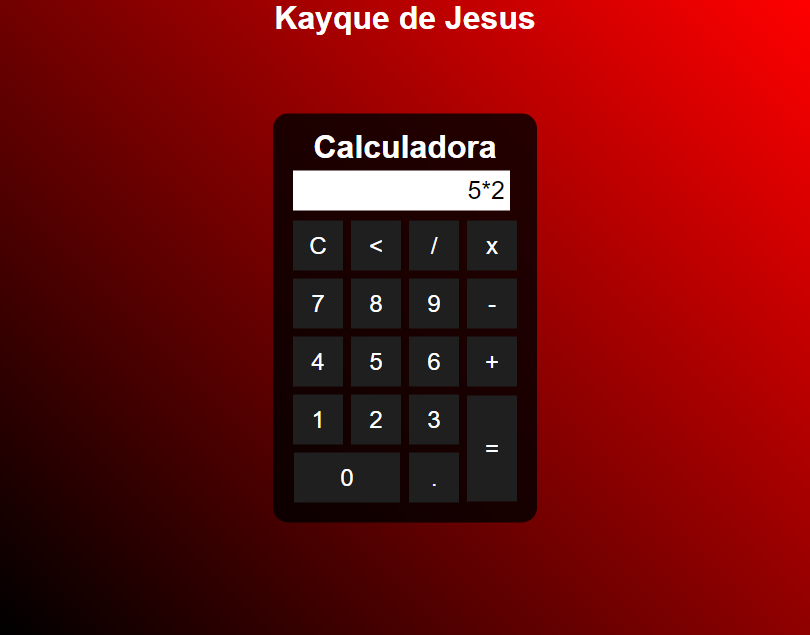

# Calculadora

Uma alculadora simples. Com operações de adição, subtração, multiplicação e divisão.(O botão "C" apaga tudo, e "<" apaga um caractere de cada vez no display.)

[🔗 Clique aqui para acessar a página]()

## 💻 Tecnologias

- HTML
- CSS
- JavaScript

## 📖 O que aprendi?
- Funções em JavaScript

## ✉️ Contato

kayquejesusdn@gmail.com